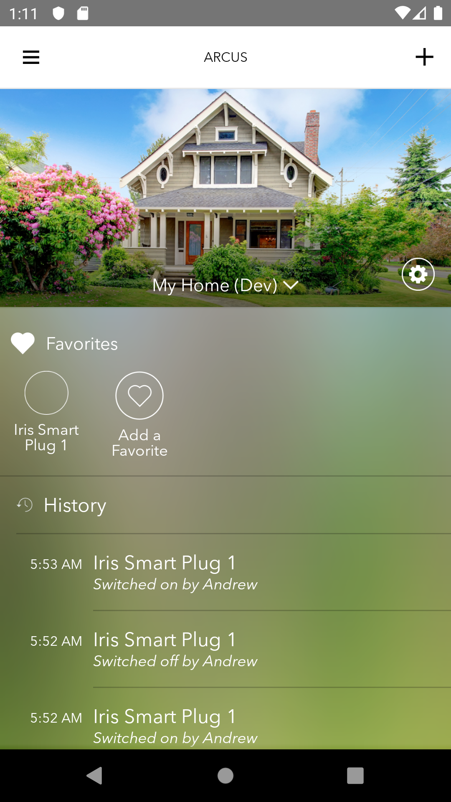

# Arcus Android App

The Arcus Android app connects to the Arcus Platform. In order to use the Android app, you will need to have access to a running instance of Arcus Platform.

# Quickstart

1. Download Android Studio
1. Open the project in Android Studio 
   1. *Note:* Open an existing AndroidStudio project should work fine
1. Build and run the project

## Optional Setup

To avoid having to enter the URL on the login page you can:
1. Add an `environment.gradle` file to the project root with the base URLs you want to use. Example:
   1. Supported Variables: 
      1. Platform URL: `ext.arcusBasePlatformUrl="http(s)://your.server.domain:port"`
